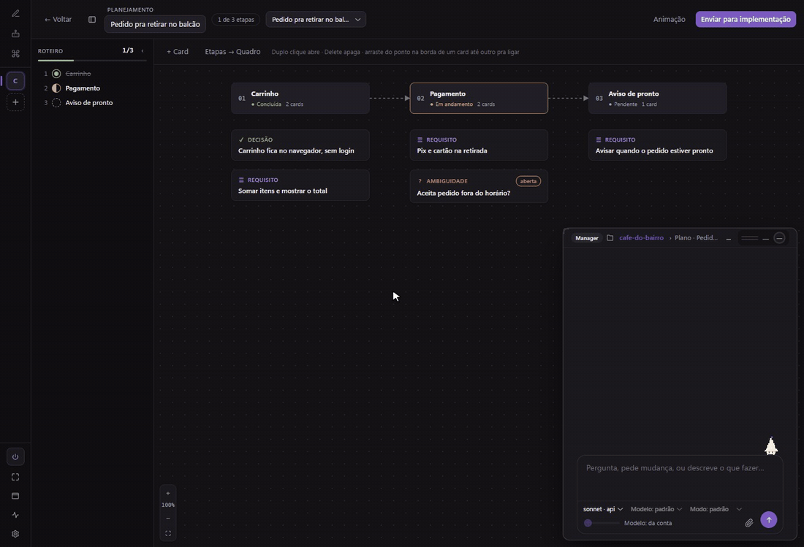
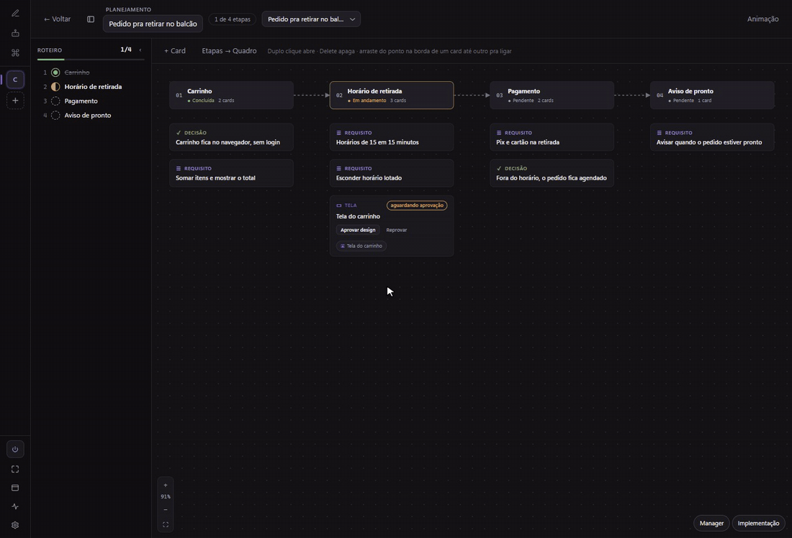
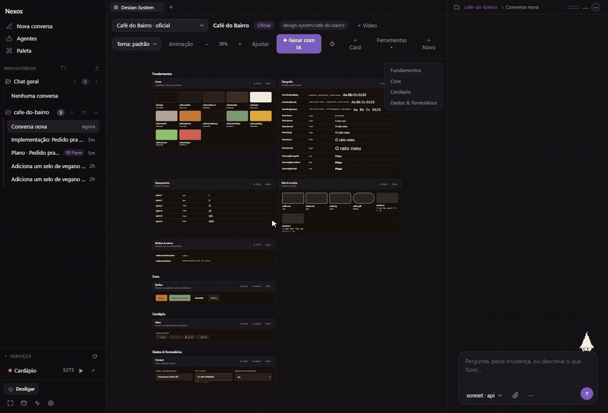
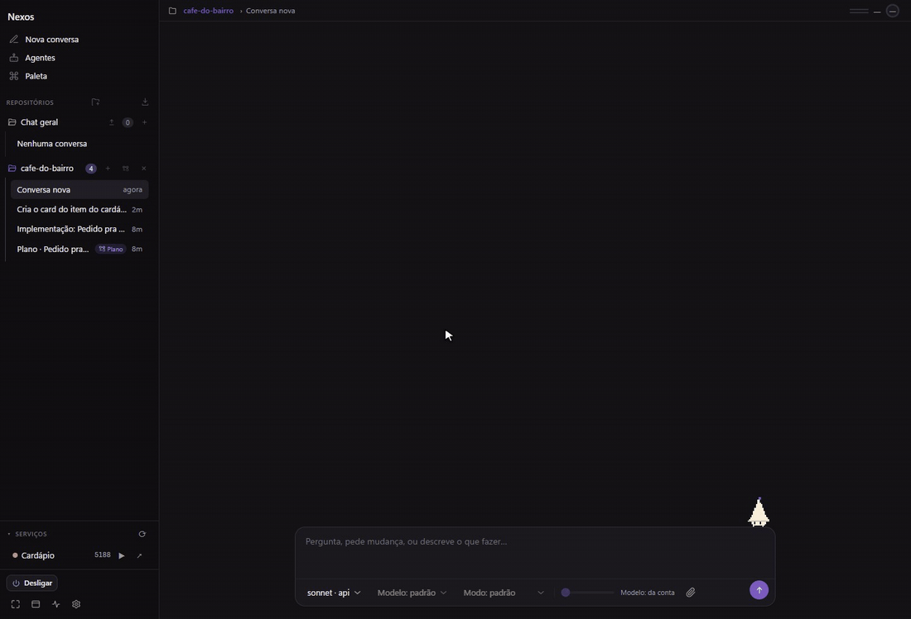

<div align="center">


# Nexos

**Orquestrador local de agentes de código.**
Chat, times de agentes, planejamento, design system e vídeo, tudo rodando na sua máquina
com as CLIs que você já usa (Claude Code, Codex) ou por API.

[](https://github.com/Yanngc32/Nexos/releases/latest)
[](https://github.com/Yanngc32/Nexos/actions/workflows/ci.yml)
[](LICENSE)


[Veja funcionando](#veja-funcionando) · [O que ele faz](#o-que-ele-faz) · [Instalar](#instalar-windows) · [Rodar do código](#rodar-do-c%C3%B3digo) · [Times de agentes](#times-de-agentes) · [Celular](#do-celular) · [Segurança](#seguran%C3%A7a) · [Changelog](CHANGELOG.md)

</div>

---

Um daemon roda na sua máquina, fala com CLIs de agente já instaladas nela (Claude Code,
Codex) ou com API, e um app Electron serve de interface. Também dá pra acompanhar e
conversar do celular, pela interface web que o próprio daemon serve.

Tudo é local: nenhum dado sai da máquina além do que a própria CLI do agente já manda pro
provedor dela.

## Veja funcionando

Gravações do app de verdade, num projeto de exemplo (o cardápio de um café).

### Planejamento
Você conversa com o Manager e o plano muda na hora: etapa nova no roteiro, requisitos nos cards e a dúvida em aberto vira decisão.

<p align="center"></p>

### Mock de tela antes do código
Card de tela no plano espera sua aprovação. Você abre o mock, aprova, e a implementação recebe o aviso pra codar.

<p align="center"></p>

### Design system
Tokens, fundamentos e cards do DS do projeto no Canvas. O agente cria um card pelo chat, ele aparece no board, e o tema claro espelha tudo.

<p align="center"></p>

### Chat
Você pede, o agente propõe, aplica nos arquivos e você confere no preview sem sair do app.

<p align="center"></p>

## O que ele faz

| | |
| --- | --- |
| **Chat com o agente** | Até 3 conversas lado a lado, cada uma com árvore de arquivos, terminal e preview do projeto. No Claude Code, mensagem nova entra no turno em andamento, sem esperar ele acabar. |
| **Agentes e times** | Crie agentes com bancada de teste e junte em times: em sequência, em paralelo (cada um no seu `git worktree`) ou sob um supervisor que decide quem trabalha. |
| **Planejamento** | Um Agent Manager quebra o trabalho em etapas, liga cada uma a uma tarefa do quadro e acompanha a implementação. |
| **Canvas e design system** | Tokens, regras e cards do DS do projeto; todo mock de tela vai pro painel de mocks e só vira código depois de aprovado. |
| **Vídeo** | Monte um vídeo curto de release com a cara do DS, cena a cena, com trilha e efeitos, e renderize em MP4. |
| **Navegador e Chrome** | O agente usa um navegador embutido ou, pela extensão, abas do seu Chrome, só as do grupo "Nexos". |
| **Serviços do projeto** | Sobe, para e mostra o log dos serviços locais; porta ocupada mostra quem está nela. |
| **Celular** | PWA servida pelo daemon, pareada por QR, pelo Tailscale ou WireGuard. |
| **Painel flutuante** | Janela pequena sempre por cima com o que está rodando, quota e custo. |

## Instalar (Windows)

Baixe o instalador em **[Releases](https://github.com/Yanngc32/Nexos/releases/latest)** —
`Nexos Setup X.Y.Z.exe`, na seção Assets da release mais recente — e rode. Não precisa de
Node, pnpm nem clonar o repositório: o daemon vai empacotado junto do app.

O instalador não é assinado (ver [docs/RELEASE.md](docs/RELEASE.md#assinatura-de-código)),
então o Windows SmartScreen mostra o aviso padrão de "Editor desconhecido" — clique em
**Mais informações → Executar assim mesmo**.

Depois de instalado, o app se atualiza sozinho: baixa a versão nova em segundo plano e
avisa quando estiver pronta (Configurações → Sistema → Sobre mostra a versão atual). Nunca
instala no meio de um agente trabalhando.

Quem quer rodar a partir do código (outra plataforma, ou pra desenvolver) segue
[Rodar do código](#rodar-do-c%C3%B3digo).

## Rodar do código

### Requisitos

- Node.js 20+
- pnpm 9 (`corepack enable`)
- Para o motor `claude`/`codex`: a CLI correspondente instalada e logada
- Para o motor `api`: uma chave do provedor (guardada em `~/.nexos/profiles/<id>/`)

### Instalação

```bash
pnpm install
```

### Uso

```bash
pnpm up          # sobe o daemon (http://127.0.0.1:7432)
pnpm desktop     # abre o app Electron
pnpm test        # testes do daemon e do app (vitest)
pnpm typecheck   # tsc --noEmit nos pacotes TypeScript
pnpm check       # typecheck + testes (é o que o CI roda)
```

No Windows, `run.bat` instala as dependências se faltarem e abre o app.
`make-shortcut.ps1 -Desktop` cria um atalho que abre o app sem console.

#### CLI

```
nexos up | down
nexos skill install
nexos profile add <id> --engine stub|claude|codex|api
nexos profile ls | rm <id>
nexos profile set <id> [--model ...] [--effort ...] [--mode ...]
nexos login <id>
nexos svc ls | up <id>|--all | down <id>|--all | restart <id> | logs <id> | trust
nexos thread new <perfil> | ls [pasta] | show <id>
nexos branch ls | rm [pasta] [--run <id>]
nexos chat <perfil>
nexos switch <perfil> --thread <id>
```

## Times de agentes

### Como um time trabalha

| topologia | quem roda | pra quê |
| --- | --- | --- |
| sequência | um por vez, a saída de um vira a entrada do próximo | escrever e depois revisar |
| paralelo | todos menos o último ao mesmo tempo; o último junta | várias leituras independentes do mesmo código |
| supervisor | o primeiro decide quem chamar, uma rodada por vez, até encerrar | trabalho cujo caminho não dá pra escrever antes |

O supervisor manda por um de dois canais:

- **por turno** (padrão): ele responde a ordem em texto, o daemon executa e volta com o resultado
  no turno seguinte da mesma conversa. Custa **um turno por decisão** e roda em qualquer motor.
- **por ferramenta (MCP)**: o daemon vira servidor MCP e ele chama os membros sem sair do turno —
  o run inteiro cabe num turno só. Só em conta `claude`; nas outras o Nexos cai de volta pro canal
  por turno e registra o motivo em `canalOff`.

Nos dois casos quem executa o membro é o daemon, e quantas rodadas vão acontecer é o supervisor
quem escolhe — use `maxSteps` no orçamento do run pra fechar a conta.

### O modelo montando o time

Numa conversa com conta `claude` ou `codex`, o modelo recebe três ferramentas pra
**criar e editar** agentes e times: `nexo_contexto` (o que existe), `nexo_agente_salvar` e
`nexo_time_salvar`. Elas validam com as mesmas funções que a tela usa, então o que
ele cria é o que você criaria.

**Ele não executa.** Nem dispara run, nem apaga definição. A assimetria é o
critério: definição errada você conserta em um segundo, enquanto um run gasta
quota e escreve branch no seu repositório — isso continua sendo seu clique. Quem
quer o run pede o run.

As regras moram nas descrições das ferramentas, então isso funciona sem instalar
nada. `nexos skill install` acrescenta a camada de julgamento — quando vale montar
um time em vez de fazer o trabalho, qual topologia serve pra quê, o que faz um
`instructions` prestar — em `~/.claude/skills/`, valendo em todos os projetos. É
comando explícito porque `~/.claude` é configuração de outra ferramenta.

Vale em conta `claude` e em conta `codex`, cada um do jeito dele (arquivo de config
num, chave de config e token por variável de ambiente no outro). Nas contas `api` e
`stub` não vale, e a tela continua sendo o caminho garantido: o `api` é chamada HTTP
direta ao provedor, sem cliente MCP nenhum — dar ferramenta a ele significaria o Nexos
rodar o laço de ferramenta por conta própria, que é outra coisa.

O **supervisor** por MCP segue só em `claude`: o servidor dele é preso ao run e vem
carimbado na conversa como caminho de arquivo, formato que o `codex` não usa. Em conta
`codex` o supervisor usa o canal por turno.

### O que o Nexos escreve no SEU repositório

Um time em paralelo (fan-in) dá a cada membro uma árvore de trabalho própria via `git worktree`,
num branch `nexo/<run>/<n>-<agente>`. A árvore sai do disco quando o run acaba; **o branch fica**,
porque é ele que guarda o que o agente fez. Nada é mesclado automaticamente — quem decide o que
fazer com o trabalho é você:

```bash
git branch --list 'nexo/*'          # o que os agentes produziram
git diff main..nexo/<run>/1-<ag>  # o que um membro mudou
git branch -D nexo/<run>/1-<ag>     # descartar
```

Como o branch fica, eles acumulam — um por membro por run. A limpeza:

```bash
nexos branch ls               # o que existe, e o que já está no HEAD
nexos branch rm               # apaga SÓ o que já está no HEAD
nexos branch rm --run <id>    # o mesmo, restrito a um run
```

O `rm` nunca apaga branch com commit fora do HEAD: seria jogar fora trabalho que
ninguém olhou, que é exatamente o que preservar o branch evita. Esses aparecem
listados, com a data, pra você decidir — e `git branch -D` continua sendo o jeito
de forçar. Branch de run em andamento também não sai: quem recusa é o git, porque
ele está em checkout numa árvore viva.

Projeto que não é repositório git roda igual, mas sem isolamento: os membros paralelos dividem a
mesma pasta e vão se atropelar se escreverem arquivo. O run registra isso, e a tela avisa.

## Do celular

O daemon serve uma interface de celular em `/app/` — sem instalar nada, sem build.
Ela mostra o que está rodando e deixa conversar; árvore de arquivos e terminal ficam
de fora (hoje só existem no processo do Electron, e telefone não é onde se lê diff).

**Ligar a ponte, uma vez:**

1. Tenha um túnel de pé no PC e no celular (Tailscale, WireGuard). Não precisa
   descobrir nem digitar o IP: o Nexos acha sozinho.
2. No PC: **Configurações → Celular → Gerar código**.
3. Aponte a câmera do celular pro QR. Ele abre a página e conecta.
4. No celular, **Adicionar à tela de início**. Vira um app.

Pronto — e é uma vez só. O celular fica conectado através de reinícios do daemon e
da máquina; não há código pra escanear de novo no dia seguinte. Pra revogar, o botão
**Desconectar celulares** sorteia um token novo e derruba todos.

**Como ele se acha.** O daemon escuta sempre no loopback (por onde o app do desktop
fala) e, além disso, em qualquer endereço de túnel que a máquina tenha — Tailscale
pelo bloco `100.64/10` e `fd7a:115c:a1e0::/48`, WireGuard pelo nome da interface.
Túnel que sobe **depois** entra em segundos, sem reiniciar nada; túnel que cai sai
sozinho. O painel diz onde você está alcançável agora.

Wi-Fi e IP público ficam de fora por padrão: publicar ali é escolha, não
conveniência. Em **Endereço de escuta (avançado)** dá pra fixar um endereço
específico — `0.0.0.0` publica na rede inteira e aí o token é a única barreira, então
não faça isso em Wi-Fi compartilhado. Endereço fixado que não existir mais é falha
registrada na tela, não daemon que se recusa a subir.

O código do pareamento tem 6 caracteres em base32 sem `I`, `L`, `O` e `U`: pelo mesmo
trabalho de digitar, o espaço vai de 10⁶ pra 32⁶ (mais de um bilhão). As letras que se
confundem com `1` e `0` ficam fora do sorteio e são aceitas na digitação. Vale 2
minutos, serve uma vez, e 5 erros o queimam.

**O QR carrega o endereço e o código — nunca o token.** É por isso que ele é
aceitável: quem fotografa a tela leva um segredo que expira em 2 minutos e serve uma
vez, não uma credencial permanente.

## Painel flutuante

`Ctrl+Shift+W`, o botão **Painel** no rodapé ou a bandeja abrem uma janela pequena que fica sempre
por cima: passo do run em andamento, conversas trabalhando, quota por conta e custo acumulado. Ela
existe pra responder "está andando?" sem trazer o Nexos pra frente — um time roda por minutos
enquanto você está no editor. Arraste pela faixa do título; ela reabre onde estava.

O que ela mostra é do **projeto aberto** (o cabeçalho diz qual). A quota é exceção: é da conta, não
do projeto. Sem projeto aberto, ela mostra tudo que o daemon está fazendo.

## Por dentro

### Compactação automática de contexto

Quando o histórico encosta em 80% do que cabe no turno, o Nexos **resume** o
trecho antigo em vez de cortá-lo, e passa a mandar o resumo no lugar dele. As
últimas mensagens seguem verbatim: recência é o que mais importa pro turno
seguinte.

Antes disso o corte era o único caminho, e ele guardava os primeiros 2000
CARACTERES do que jogava fora, cortados no meio da palavra — o meio da conversa
desaparecia inteiro. O corte continua existindo como último recurso, pra quando
o resumo ainda não couber ou o motor falhar em produzi-lo.

O `claude` tem autocompact próprio, mas ele nunca dispara aqui: o Nexos faz um
spawn por turno com `--print`, então não existe sessão longa pra ele compactar.
A memória da conversa é do Nexos, e a compactação também.

**Custa um turno da sua conta**, com o trecho antigo como entrada — e se paga nos
turnos seguintes, que passam a mandar o resumo. Desligue com
`pack.compactar: false` no `config.json` se preferir o corte. A entrada do resumo
é limitada ao mesmo teto do turno: conversa muito longa é compactada em pedaços,
do mais antigo pra frente, e o resumo anterior entra na entrada do seguinte pra
que o resultado continue sendo um resumo só.

Nada é perdido do disco: o `threads/<id>.jsonl` guarda tudo pra sempre, e o
resumo é um evento a mais. A tela mostra a compactação acontecendo (o anel do
contexto pulsa) e deixa o resumo aberto pra leitura na linha do tempo.

### Estrutura

```
apps/daemon      servidor HTTP (Hono) + CLI + motores
apps/desktop     app Electron (main/preload/renderer + módulos do renderer)
apps/mobile      interface de celular (PWA), servida pelo próprio daemon
apps/chrome-extension  extensão MV3 que dá ao agente as abas do grupo "Nexos" (`pnpm chrome`)
packages/shared  tipos e constantes compartilhados
docs/            specs e plano de implementação
```

Nenhum pacote compila: o daemon roda via `tsx` e o `@nexos/shared` é consumido como fonte
(`exports` aponta para o `.ts`). O `tsc` existe só como checador (`pnpm typecheck`).

### Estado no disco

Tudo fica em `~/.nexos` (ou `NEXOS_HOME`):

| caminho | conteúdo |
| --- | --- |
| `config.json` | porta, perfis de fallback, tema, projetos |
| `profiles/<id>/` | credenciais e config por perfil |
| `threads/<id>.jsonl` | histórico das conversas |
| `attachments/<thread>/` | imagens anexadas |
| `agents.json` | agentes personalizados |
| `teams.json` | times de agentes |
| `runs/<id>/` | execução de time: `run.json` e o artefato de cada passo |
| `daemon.token` | token bearer da API local (modo `0600`) |
| `run/` | PIDs do daemon e dos motores |

Nada disso está no repositório — e não deve ser commitado.

## Segurança

- O daemon escuta em `127.0.0.1` por padrão — nada de fora da máquina alcança. Isso é
  configurável (ver [Do celular](#do-celular)), e mudar é uma escolha de segurança: fora do
  loopback, quem alcançar a porta só é barrado pelo token, e não há TLS.
- Toda rota `/v1/*` exige `Authorization: Bearer <token>` — inclusive a que abre um
  pareamento, e isso é o que faz o código curto valer: quem pudesse ABRIR um pareamento
  sem credencial já conheceria o código, e não haveria nada a adivinhar. Um teste varre a
  tabela de rotas e falha se qualquer `/v1/*` responder sem o bearer, porque no Hono a
  autenticação depende da ordem de registro e uma rota aberta não dá erro nenhum.
- O token tem 192 bits e fica em `~/.nexos/daemon.token` (modo `0600`). Ele
  **sobrevive** às subidas do daemon, senão o celular desparearia a cada reinício —
  sessão que morre sozinha não é segurança, é atrito. A revogação é explícita:
  **Desconectar celulares** sorteia um novo e derruba todos de uma vez.
- A **única** rota sem autenticação é `POST /pair`, que existe pra entregar o token a um
  celular que ainda não tem. Ela só serve com um código de 6 caracteres (base32, ~10⁹) que
  vale 2 minutos, serve uma vez e queima em 5 erros. O teto de erros é a trava principal:
  nenhum segredo curto sobrevive a um varrimento sem ele.
- O QR que a tela mostra carrega o endereço e o código. O token não aparece em tela
  nenhuma.
- O terminal e a árvore de arquivos do app são presos à pasta do projeto aberto
  (resolução de symlink inclusa).
- O app dá ao agente acesso de leitura/escrita e execução de comandos no projeto aberto.
  Trate como o que é: um shell com um modelo na frente. Não aponte para pastas que você
  não confiaria a um script de terceiros.

## Contribuindo

[CONTRIBUTING.md](CONTRIBUTING.md) — as convenções que não se descobrem lendo o código:
por que nada compila, o que o Windows quebra, e a barra para uma dependência nova.

## Licença

MIT — ver [LICENSE](LICENSE).

O painel de vídeo leva músicas (ende.app, CC BY 4.0), efeitos (Kenney, CC0), trechos do
[brag](https://github.com/latent-spaces/brag) (MIT) e do Hyperframes (Apache 2.0), GSAP e fontes OFL:
créditos e licenças em [THIRD_PARTY_NOTICES.md](THIRD_PARTY_NOTICES.md).
